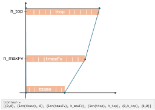
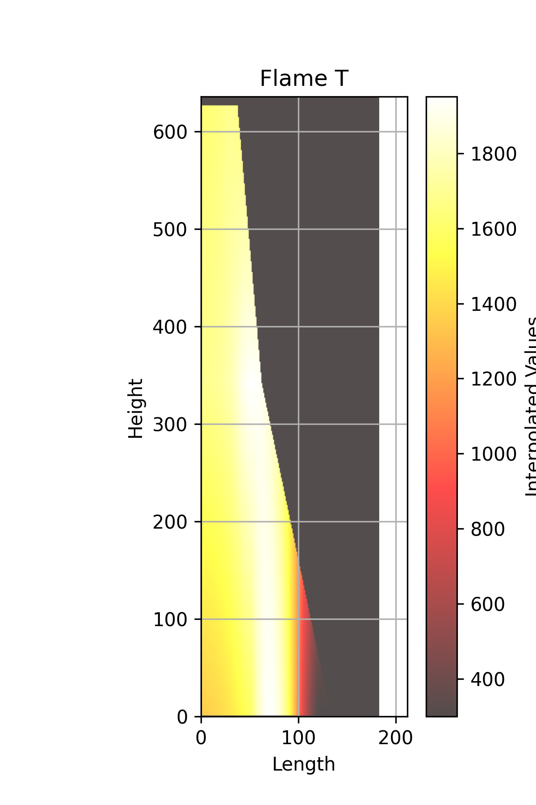

# Soot Profiles Generate Synthetic Data
Generating synthetic data for deep models that extract soot properties from flame images. Collaboration with a project of Dr. by Victor Chernov, Department of Mechanical Engineering, Braude College


# Generate Data Algorithm

**Author:** Mosheat Alon-Moses  
**Date:** May 2025

## Table of Contents

- [Introduction](#introduction)
- [Generate Fv, T Data](#generate-fv-t-data)
  - [Flame Heights](#flame-heights)
  - [Fv Vectors](#fv-vectors)
  - [T Vectors](#t-vectors)
  - [Fv Matrix](#fv-matrix)
  - [T Matrix](#t-matrix)
- [Generate RGB Image](#generate-rgb-image)
  - [sootCalculation.mat](#sootcalculationmat)
  - [Run through SootImage](#run-through-sootimage)
- [Results](#results)
- [Known Issues and Future Work](#known-issues-and-future-work)
- [Appendices](#appendices)
  - [Appendix A - Accepting Data Restrictions](#appendix-a---accepting-data-restrictions)
  - [Appendix B - Generate Data Matlab Code](#appendix-b---generate-data-matlab-code)
  - [Appendix C - SootImage Matlab Code](#appendix-c---sootimage-matlab-code)

<a id="introduction"></a>
## Introduction

Our research relies on flame RGB images for investigating soot properties. My role is to create a deep learning model for extracting the soot properties upon a given RGB digital camera image of an axisymmetric laminar flame. For me to train such a model, I need data. Existing simulators have their downside as they are slow, not very accurate and complicated for configuration. There was a big need for creating such synthetic data.

Victor created a few Matlab files calculating properties of 3 vectors of the flame. After filtering out problematic data based on a linear interpolation, I completed values of Fv (soot fractions volume) and T (temperature) in each pixel of the flame. I then used Victor's sootImage for creating an RGB image of the flame upon the given generated data.


## Generate Fv, T Data
<a id="generate-fv-t-data"></a>
Generating the data is done with a few random picks. Therefore, there are a few restrictions that must be verified before the data generated is accepted for next steps.

Once the two heights (h_top, h_maxFv), three Fv vectors (fbase, fmaxFv, ftop) and three T vectors (tbase, tmaxFv, ttop) are generated as detailed below, the data goes through a number of verification steps as detailed in [Appendix A](#appendix-a---accepting-data-restrictions). If verification fails, the data is regenerated until all terms and restrictions are met.

### Flame Heights

To generate the flame's contour, I begin with randomly generating 2 heights:

- **h_top** - the top (currently, it isn't the tip of the flame, but it is the top height of the flames we produce)
- **h_maxFv** - this is a height that holds the maximum Fv (soot fractions volume) value of the flame

First, I draw a random number between 200 and 400 as the flame's h_maxFv.  
Next, I draw another random number between 200 and 400 and add it to h_maxFv. This is the flame's h_top.

When relating to the base of the flame, height 0.

### Fv Vectors

Once I have h_maxFv and h_top heights, I run Matlab functions to generate 3 vectors of soot fractions volume in every height (base, maxFv, top):

```
fbase = generatef(1)
fmaxFv = generatef(4)
ftop = generatef(7)
```
<div align="center">
  
</div>
Now I know the size of each vector in every height, I can create the flame's Fv contour.

The Fv contour will be the flame's edges I will regard to when dealing with both the soot fractions volume and the temperature properties.


Notice fmaxFv holds the highest Fv value and `len(fbase) > len(fmaxFv) > len(ftop)`. Both restrictions are by definition.

See [Appendix A](#appendix-a---accepting-data-restrictions) for all restrictions.

### T Vectors

Next, I generate the temperature vectors. Here too I regard h_maxFv and h_top heights. I run Matlab functions to generate 3 vectors of temperature in every height (base, maxFv, top):

```
tbase = generateT(1)
tmaxFv = generateT(4)
ttop = generateT(7)
```
<div align="center">
  
</div>
For some reason, the T vectors are generated vertically, so I transpose them before continuing.

Flame's T contour is different than flame's Fv contour. It is generally wider, and there is no rule as for which section (ttop, tmaxFv or tbase) is wider.

In any case, populating tmatrix is done according to flame's Fv contour.


See [Appendix A](#appendix-a---accepting-data-restrictions) for all restrictions for accepting the generated data.

### Fv Matrix

After generating the 3 Fv vectors, I want to populate the Fv matrix. I run on each (x,y) in the Fv matrix (fvmat).

1. **Create a matrix** fvmat with shape of:
   - `width = len(fbase) + 50`
   - `height = h_top + 10`

2. **Initialize** fvmat with zeros and attend only the cells within the Fv contour. This way, values outside the contour remain 0.

3. **Insert vectors** at specific heights:
   - fbase at y=0
   - fmaxFv at y=h_maxFv
   - ftop at y=h_top

4. **Set contour values** - For cells on the Fv contour submit the value 0.1.

5. **Linear interpolation** - Fill in the missing data inside the Fv contour boundaries by calculating a linear interpolation between the bottom vector and the top vector, depending on the weight calculated according to the Y position. This means when weight is 0, I'll get values as `bottom_vector[x]`; when weight is 1, I'll get values as `top_vector[x]`; and for values in between, I'll get a blend. By doing this I get smooth transitions from the base to the top as I move vertically.

   This is done in two regions - one between fbase and fmaxFv and the other one between fmaxFv and ftop.

   In each region I calculate:
   - `weight = (y - 0) / (h_maxFv-0)`

   Because the bottom vector is longer than the top vector, I have 2 cases:
   - **If x is within the range of top vector**: Interpolate between `bottom_vector[x]` and `top_vector[x]` using the formula:  
     `(1 - weight) * bottom_vector[x] + weight * top_vector[x]`
   
   - **If x is outside the range of top_vector** (so `top_vector[x]` does not exist), and the current matrix value is 0: Interpolate between `base[x]` and a small constant value of 0.1, using the same weight:  
     `(1 - weight) * bottom_vector[x] + weight * 0.1`
     


### T Matrix

After generating the 3 T vectors, I want to populate the T matrix. I run on each (x,y) in the T matrix.

1. **Create a matrix** tmat with shape of:
   - `width = max(len(tbase), len(tmaxFv), len(ttop)) + 50`
   - `height = h_top + 10`

2. **Initialize** tmat with 300 (units are in Kelvin, so this is the zero value) and attend only the cells within the Fv contour. This way, values outside the contour remain 300.  
   *Reminder: populating tmatrix is done according to flame's Fv contour.*

3. **Insert vectors** at specific heights:
   - tbase at y=0
   - tmaxFv at y=h_maxFv  
   - ttop at y=h_top

4. **Set contour values** - For cells on the Fv contour submit the value 300.

5. **Linear interpolation** - Fill in the missing data inside the Fv contour boundaries by calculating a linear interpolation between the bottom vector and the top vector, depending on the weight calculated according to the Y position. This means when weight is 0, I'll get the value as `bottom_vector[x]`; when weight is 1, I'll get the values as `top_vector[x]`; and for values in between, I'll get a blend. By doing this I get smooth transitions from the base to the top as I move vertically.

   This is done in two regions - one between tbase and tmaxFv and the other one between tmaxFv and ttop.

   In each region I calculate:
   - `weight = (y - 0) / (h_maxFv-0)`

   Because (by definition) the shortest temperature vector is longer than fbase (the longest Fv vector) and because we are interested in the Fv contour, we use the following 2 cases:
   - **If x is within the range of fbase vector**: Interpolate between `bottom_vector[x]` and `top_vector[x]` using the formula:  
     `(1 - weight) * bottom_vector[x] + weight * top_vector[x]`
   
   - **If x is outside the range of fbase vector** (so `top_vector[x]` does not exist), and the current matrix value is 300: Interpolate between `top[x]` and a constant value of 300, using the same weight:  
     `matrix[y, x] = (1 - weight) * 300 + weight * top_vector[x].item()`



*Flame T is populated according to Flame Fv contour. In Blue- T contour*

## Generate RGB Image

### sootCalculation.mat

At this point I have 2 matrices for T and Fv.

Next, I want to generate the flame RGB. Generating the flame RGB is done using Victor's SootImage tool. The tool gets as an input a `sootCalculation.mat` file that holds in it 4 matrices: T, fv, r, z.

- **fv** is fvmatrix, saved as is
- **T** is tmatrix clipped to fvmatrix shape: `tmatrix = tmatrix[:fvmatrix.shape[0], :fvmatrix.shape[1]]`
- **r** is a vector, size as the smaller side of the matrices. Values are from 0 in steps of 0.0662 (pixel size)
- **z** is a vector, size as the larger side of the matrices. Values are from 0 in steps of 0.0662 (pixel size)

### Run through SootImage

Using sootImage tool (MATLAB files) with `sootCalculation.mat` as an input, I get the following files:

- `CFDImage.mat` - holding the flame's RGB image matrix
- `redMatrixCFD.mat` - holding the flame's R image matrix
- `greenMatrixCFD.mat` - holding the flame's G image matrix  
- `blueMatrixCFD.mat` - holding the flame's B image matrix

Last thing I do is to generate an image out of `CFDImage.mat` and save an `info.txt` about the run.

<div align="center">
  
</div>  

<a id="results"></a>
## Results

For the DL model, I need data from:

- **Input** - RGB flame image
- **Output** - Soot Fraction Volume in every pixel of the flame
- **Output** - Temperature in every pixel of the flame

Using the processes and algorithms described above, I can create a dataset without the costly resources of a simulator.

**Performance**: Generating a sample takes approximately 30 seconds, varying in correspondence with the drawn size of the flame and times generated until conditions are met.

### Generated Files

The following files are generated by each sample:

| File name | Description |
|-----------|-------------|
| `info.txt` | Summary of run, holding info such as h_maxFv and h_top, Fv and T Data (generated vectors, sizes, shapes, contours) and r, z shapes |
| `ttop.csv` | Top of flame's temperature vector generated using Matlab function generateT(7) |
| `tbase.csv` | Base of flame's temperature vector generated using Matlab function generateT(1) |
| `tmaxFv.csv` | Temperature vector at the height of the maximum soot fraction volume (h_maxFv) in the flame, generated using Matlab function generateT(4) |
| `T_interpolated_matrix.csv` | Matrix holding all values of flame's temperature in Fv contour (cut to size of Fv matrix) |
| `ftop.csv` | Top of flame's soot fraction volume vector generated using Matlab function generatef(7) |
| `fbase.csv` | Base of flame's soot fraction volume vector generated using Matlab function generatef(1) |
| `fmaxFv.csv` | Soot fraction volume vector at the height of the maximum soot fraction volume (h_maxFv) in the flame, generated using Matlab function generatef(4) |
| `Fv_interpolated_matrix.csv` | Matrix holding all values of flame's soot fraction volume |
| `CFDImage.mat` | MAT file holding flame RGB image 3D matrix |
| `sootCalculation.mat` | Mat file holding Fv, T, r, z matrices. This object is the input of sootImage tool and output of DL model |
| `redMatrixCFD.mat` | Mat file holding red matrix of the RGB flame image |
| `greenMatrixCFD.mat` | Mat file holding green matrix of the RGB flame image |
| `blueMatrixCFD.mat` | Mat file holding blue matrix of the RGB flame image |
| `T_flame_plot_noContour.png` | Plot of flame's temperature values in each pixel (in Kelvin scale, ranging from 300 and up) |
| `T_flame_plot_Contour.png` | Plot of flame's temperature values in each pixel (in Kelvin scale, ranging from 300 and up) with the contour according to the generated base, maxFv and top vectors |
| `Fv_flame_plot_noContour.png` | Plot of flame's soot fraction volume values in each pixel (in ppm scale, ranging from 0 and up) |
| `Fv_flame_plot_Contour.png` | Plot of flame's soot fraction volume values in each pixel (in ppm scale, ranging from 0 and up) with the contour according to the generated base, maxFv and top vectors |
| `flame_CFDImage_image.png` | RGB flame image |

### Essential Files for Deep Learning Model

Not all files are needed for our deep learning model. The files we need for our deep learning model are:

- **Input** - `CFDImage.mat`
- **Output** - `sootCalculation.mat` (or `T_interpolated_matrix.csv` and `Fv_interpolated_matrix.csv`)

## Known Issues and Future Work

- The flame is not generated up to its tip, but up to a random height between 400-800
- The mathematical relation between T and Fv is not considered

## Appendices

### Appendix A - Accepting Data Restrictions

When running the `generatef.m` and `generateT.m` functions, we are dealing with some randomicity of data. To provide data physically and mathematically as accurate as possible, a few restrictions and conditions were defined:

1. `h_maxFv, h_top, fbase, fmaxFv, ftop, tbase, tmaxFv, ttop` set was not used before
2. `len(fbase) > len(fmaxFv) > len(ftop)`
3. The max value of fmaxFV is greater than max value of fbase and of ftop
4. All T vectors' length must be greater than fbase length

> **Note**: There is no restriction as to which vector is longer between the T vectors.

### Appendix B - Generate Data Matlab Code

#### Generate Fv
*[Code section to be populated]*

#### Generate T
*[Code section to be populated]*

### Appendix C - SootImage Matlab Code
*[Code section to be populated]*

